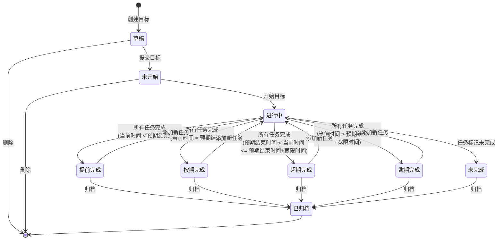
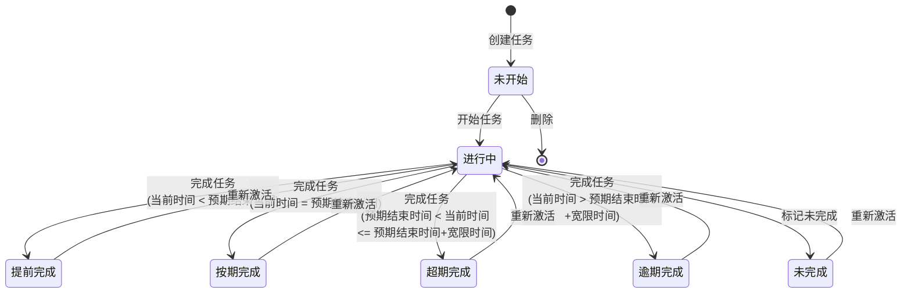

# OKR Todo 产品需求文档（PRD）

## 📄 文档信息

| 项目 | 内容 |
|------|------|
| **产品名称** | OKR Todo 目标任务管理系统 |
| **文档版本** | v2.4 |
| **创建日期** | 2026-01-07 |
| **更新日期** | 2026-01-07 |
| **产品经理** | DataSelfCloud Team |
| **文档类型** | 产品需求文档（PRD） |

---

## 1. 产品概述

### 1.1 产品愿景

打造一款简洁高效的个人目标管理工具，帮助用户将宏大目标拆解为可执行的任务，通过清晰的进度追踪和时间管理，让每一个目标都能落地实现。

### 1.2 产品定位

**一句话描述**：基于 OKR 理念的个人目标与任务管理工具

**目标用户**：
- 主要用户：需要进行个人目标管理的知识工作者
- 使用场景：工作规划、学习计划、项目管理、个人成长

**核心价值**：
1. **目标导向**：从目标出发，确保每个任务都有明确的价值
2. **进度可视**：实时追踪目标完成情况，一目了然
3. **时间管理**：预期 vs 实际时间对比，培养时间感知能力
4. **成就感**：完成状态细分，让每一次完成都有仪式感

### 1.3 产品边界

**支持平台**：
- ✅ **Web 管理端**（优先开发）：桌面浏览器访问，完整功能
- ✅ **iOS App**（优先开发）：iPhone 和 iPad 原生应用
- 🔮 **macOS App**（后期开发）：Mac 桌面应用

**开发优先级**：
1. **第一阶段**：Web 管理端 + iOS App
2. **第二阶段**：macOS App

**本期包含**：
- ✅ 目标与任务的创建、编辑、删除
- ✅ 目标与任务的状态管理
- ✅ 时间管理（预期时间、实际时间）
- ✅ 完成进度追踪
- ✅ 任务评分和目标得分
- ✅ 总结与复盘功能
- ✅ 基础数据统计

**本期不包含**：
- ❌ 团队协作功能
- ❌ 第三方集成（日历、邮件等）
- ❌ AI 智能推荐
- ❌ macOS 桌面应用（后期开发）

**未来规划**：
- 🔮 macOS 桌面应用
- 🔮 数据可视化看板
- 🔮 习惯养成功能
- 🔮 团队协作功能
- 🔮 AI 智能分析和建议

---

## 2. 用户故事与使用场景

### 2.1 典型用户画像

**用户A - 产品经理小李**
- 年龄：28岁
- 职业：互联网产品经理
- 痛点：工作目标多，容易忘记，不知道哪些任务对目标达成更重要
- 需求：需要一个工具帮助他管理季度 OKR，并拆解为每周的具体任务

**用户B - 在读研究生小王**
- 年龄：24岁
- 职业：研究生
- 痛点：论文进度难以把控，经常拖延
- 需求：需要将论文目标拆解为可执行的小任务，并追踪完成情况

### 2.2 核心使用场景

#### 场景1：制定季度工作目标
```
小李在季度初需要制定本季度的工作目标：
1. 创建目标"完成产品 V2.0 上线"
2. 设置预期时间：2026-01-01 至 2026-03-31
3. 将目标拆解为多个任务：需求调研、原型设计、开发跟进、测试验收
4. 为每个任务设置预期时间和优先级
5. 每周查看目标进度，调整任务优先级
```

#### 场景2：追踪学习计划
```
小王需要在3个月内完成论文：
1. 创建目标"完成毕业论文"
2. 拆解任务：文献阅读、实验设计、数据收集、论文撰写、导师审阅
3. 每完成一个任务，系统自动更新目标进度
4. 查看时间对比，了解是否按计划推进
5. 论文完成时，系统记录实际完成时间，判定完成状态
```

#### 场景3：逾期目标处理
```
小李的某个目标逾期了：
1. 系统提醒目标已逾期
2. 小李查看未完成的任务
3. 评估是否继续推进，或标记为"未达成"
4. 如果继续推进，重新调整任务时间
5. 最终完成时，系统标记为"逾期完成"
```

---

## 3. 功能需求详细设计

### 3.1 目标管理

#### 3.1.1 目标属性定义

| 属性名称 | 属性说明 | 是否必填 | 备注 |
|---------|---------|---------|------|
| **目标标题** | 目标的名称，简洁明了 | 是 | 建议不超过50字 |
| **目标描述** | 目标的详细说明，包括背景、意义等 | 否 | 支持富文本 |
| **目标类型** | 目标所属领域 | 是 | 工作、学习、生活、健康、财务、其他 |
| **优先级** | 目标的重要程度 | 是 | P0-紧急、P1-高、P2-中、P3-低 |
| **预期开始时间** | 计划何时开始这个目标 | 是 | 可以是未来时间 |
| **预期结束时间** | 计划何时完成这个目标 | 是 | 必须晚于开始时间 |
| **宽限时间** | 允许的延期时间（分钟） | 否 | 用于判定超期完成，默认0分钟 |
| **实际开始时间** | 实际开始执行的时间 | 否 | 状态变为"进行中"时自动记录 |
| **实际结束时间** | 实际完成的时间 | 否 | 状态变为"完成"时自动记录 |
| **预期总时间** | 所有任务预期消耗时间之和 | 自动计算 | 单位：秒，展示时转换 |
| **实际总时间** | 所有任务实际消耗时间之和 | 自动计算 | 单位：秒，展示时转换 |
| **所用总时间** | 目标实际耗时 | 自动计算 | 实际结束时间 - 实际开始时间 |
| **目标状态** | 当前所处的阶段 | 是 | 详见状态定义 |
| **完成进度** | 目标的完成百分比 | 自动计算 | 基于任务完成情况 |
| **标签** | 自定义标签，便于分类 | 否 | 如：Q1、重点项目等 |
| **提醒时间** | 目标的提醒时间设置 | 否 | 可设置多个提醒时间点 |
| **目标总结** | 对目标的总结和反思 | 否 | 完成后填写，支持富文本 |
| **目标得分** | 目标的综合评分 | 自动计算 | 基于任务评分和时间完成情况 |

#### 3.1.2 目标状态流转

**状态定义**：

| 状态 | 状态说明 | 触发方式 | 系统行为 |
|------|---------|---------|---------|
| **草稿** | 目标尚在构思阶段，可随时修改 | 创建目标后的初始状态 | 不计入统计，可随时修改所有信息 |
| **未开始** | 目标已提交，等待开始执行 | 用户点击"提交目标"按钮 | 目标信息锁定，可以添加/编辑任务 |
| **进行中** | 目标正在执行中 | 用户点击"开始目标"按钮 | 记录实际开始时间，不可修改实际时间 |
| **提前完成** | 在预期时间前完成 | 所有任务完成时系统自动判定 | 记录实际结束时间，判定为提前完成 |
| **按期完成** | 在预期时间内完成 | 所有任务完成时系统自动判定 | 记录实际结束时间，判定为按期完成 |
| **超期完成** | 在宽限时间内完成 | 所有任务完成时系统自动判定 | 超过预期时间但在宽限时间内完成 |
| **逾期完成** | 超过宽限时间后完成 | 所有任务完成时系统自动判定 | 记录实际结束时间，判定为逾期完成 |
| **未完成** | 有任务标记为未完成 | 任务被标记未完成时自动触发 | 目标自动标记为未完成状态 |
| **已归档** | 目标已结束，不再显示 | 用户点击"归档" | 移入归档列表 |

**状态流转图**：


**状态流转详细规则**：

1. **草稿 → 未开始**
   - 触发：用户点击"提交目标"按钮
   - 前置条件：目标标题、类型、优先级、预期时间已填写
   - 状态变更：草稿 → 未开始
   - 系统行为：目标基本信息锁定（标题、类型等不可修改）

2. **未开始 → 进行中**
   - 触发：用户点击"开始目标"按钮
   - 状态变更：未开始 → 进行中
   - 系统行为：记录实际开始时间（系统自动记录，不可修改）

3. **进行中 → 完成状态**
   - 触发：所有任务完成时系统自动判定
   - 前置条件：目标下所有任务状态为完成（提前/按期/超期/逾期完成）
   - 状态变更：进行中 → 提前完成/按期完成/超期完成/逾期完成
   - 判定逻辑：
     * 当前时间 < 预期结束时间 → 提前完成
     * 当前时间 = 预期结束时间（当天） → 按期完成
     * 预期结束时间 < 当前时间 <= 预期结束时间+宽限时间 → 超期完成
     * 当前时间 > 预期结束时间+宽限时间 → 逾期完成
   - 系统行为：
     * 记录实际结束时间（系统自动记录，不可修改）
     * 根据实际结束时间判定完成类型
     * 计算目标综合得分
     * 弹出目标总结弹窗

4. **完成状态 → 进行中**（重新激活）
   - 触发：用户在完成状态下添加新任务
   - 状态变更：提前完成/按期完成/超期完成/逾期完成 → 进行中
   - 系统行为：
     * 清除实际结束时间
     * 保留实际开始时间
     * 重新计算进度
     * 提示"目标已重新激活"

5. **进行中 → 未完成**
   - 触发：任务被标记为未完成时自动触发
   - 状态变更：进行中 → 未完成
   - 系统行为：
     * 目标自动标记为未完成
     * 不需要用户手动操作
     * 可进行复盘

6. **完成状态/未完成 → 已归档**
   - 触发：用户点击"归档"按钮
   - 状态变更：任何完成状态或未完成 → 已归档
   - 系统行为：移入归档列表，不在主列表显示

**特殊规则**：
1. **状态不可手动修改**：所有状态变更必须通过指定的用户操作或系统自动判定触发，用户不能直接选择状态
2. **草稿状态**：可以随时删除，可以修改所有信息
3. **未开始状态**：可以删除，可以修改预期时间，不能修改基本信息（标题、类型等）
4. **进行中状态**：可以修改预期开始时间和预期结束时间，但不能修改实际开始时间
5. **完成状态**：
   - 可以修改预期开始时间和预期结束时间
   - 不能修改实际开始时间和实际结束时间
   - 可以添加新任务（添加后自动回到进行中状态）
   - 新任务完成后，系统重新判定完成状态
6. **时间修改规则**：
   - 预期开始时间和预期结束时间：在未归档前都可以修改
   - 实际开始时间：系统自动记录，永不可修改
   - 实际结束时间：系统自动记录，永不可修改

#### 3.1.3 目标完成进度计算

**计算公式**：
```
目标完成进度 = (已完成任务数 / 总任务数) × 100%
```

**特殊情况处理**：
- 目标下无任务：进度显示为 0%，提示"请添加任务"
- 目标下有任务但都未开始：进度为 0%
- 部分任务完成：按比例显示进度
- 所有任务完成：进度为 100%，提示"可以完成目标了"

**进度展示**：
- 进度条：可视化展示完成百分比
- 数字：显示"已完成 X / 总共 Y"
- 颜色：
  - 0-30%：红色（需要加油）
  - 31-70%：黄色（进展中）
  - 71-99%：蓝色（即将完成）
  - 100%：绿色（可以完成）

#### 3.1.4 时间展示规则

**存储规则**：
- 所有时间消耗字段（预期消耗时间、实际消耗时间、预期总时间、实际总时间、所用总时间）在数据库中以秒为单位存储

**展示规则**：

| 时间范围 | 展示格式 | 示例 |
|---------|---------|------|
| < 60秒 | X秒 | 45秒 |
| 60秒 - 59分59秒 | X分钟 Y秒 | 1分钟 20秒 |
| ≥ 60分钟 | X小时 Y分钟 Z秒 | 2小时 15分钟 30秒 |

**展示说明**：
- 最大时间单位为小时，不显示天数
- 如果某个单位为0，则不显示该单位（例如：2小时 0分钟 30秒 显示为 2小时 30秒）
- 秒数始终显示，即使为0秒（例如：1小时 0秒）

**示例**：
```
30秒 → 30秒
90秒 → 1分钟 30秒
3600秒 → 1小时 0秒
3661秒 → 1小时 1分钟 1秒
7200秒 → 2小时 0秒
86400秒 → 24小时 0秒
```

#### 3.1.5 目标完成判定逻辑

**自动完成触发条件**：
1. 目标状态为"进行中"
2. 目标下所有任务状态为完成（提前完成/按期完成/逾期完成）
3. 系统自动触发完成判定，无需用户手动点击

**完成时间判定**：
```
当前时间 vs 预期结束时间：
- 当前时间 < 预期结束时间 → 提前完成 ✨
- 当前时间 = 预期结束时间（当天） → 按期完成 ✅
- 当前时间 > 预期结束时间 → 逾期完成 ⚠️
```

**完成后系统行为**：
1. 自动记录实际结束时间（系统时间，不可修改）
2. 计算目标耗时（实际结束时间 - 实际开始时间）
3. 计算时间偏差（实际耗时 - 预期耗时）
4. 计算目标综合得分
5. 弹出目标总结弹窗（必填）
6. 生成完成报告
7. 提示用户进行复盘

**完成后可执行操作**：
1. **添加新任务**：
   - 用户可以在完成状态下继续添加任务
   - 添加任务后，目标状态自动从"完成状态"回到"进行中"
   - 实际结束时间被清除，实际开始时间保留
   - 新任务完成后，系统重新判定完成状态和时间

2. **修改预期时间**：
   - 可以修改预期开始时间和预期结束时间
   - 不能修改实际开始时间和实际结束时间
   - 修改预期时间会影响下次完成时的时间判定

3. **查看和编辑总结**：
   - 可以随时查看目标总结
   - 可以编辑总结内容

4. **归档目标**：
   - 确认目标真正完成后，可以归档
   - 归档后不可再添加任务或修改

#### 3.1.6 目标评分机制

**评分计算公式**：
```
目标综合得分 = 任务质量得分 × 60% + 时间完成得分 × 40%
```

**任务质量得分计算**：
```
任务质量得分 = Σ(已评分任务得分) / 已评分任务数量

说明：
- 只计算已评分的任务
- 如果所有任务都未评分，则任务质量得分为 0
- 优秀=100分、良=85分、合格=70分、差=50分
```

**时间完成得分计算**：

| 完成状态 | 得分 | 说明 |
|---------|------|------|
| **提前完成** | 100分 | 实际完成时间 < 预期结束时间 |
| **按期完成** | 100分 | 实际完成时间 = 预期结束时间（当天） |
| **超期完成** | 90分 | 在宽限时间内完成 |
| **逾期1-3天** | 80分 | 轻微逾期（超过宽限时间） |
| **逾期4-7天** | 70分 | 中度逾期 |
| **逾期8-14天** | 60分 | 严重逾期 |
| **逾期15天以上** | 50分 | 极度逾期 |
| **未完成** | 0分 | 目标未完成 |

**说明**：
- 提前完成和按期完成得分相同（100分），通过统计提前完成的数量来查看效率
- 超期完成指在宽限时间内完成，得分为90分
- 逾期完成的天数计算从宽限时间结束后开始

**评分示例**：
```
示例1：
- 目标有5个任务，其中4个任务已评分
- 任务评分：优秀(100)、良(85)、合格(70)、良(85)
- 任务质量得分 = (100+85+70+85)/4 = 85分
- 目标提前2天完成，时间得分 = 100分
- 目标综合得分 = 85×60% + 100×40% = 51 + 40 = 91分

示例2：
- 目标有3个任务，全部已评分
- 任务评分：优秀(100)、优秀(100)、良(85)
- 任务质量得分 = (100+100+85)/3 = 95分
- 目标逾期5天完成，时间得分 = 70分
- 目标综合得分 = 95×60% + 70×40% = 57 + 28 = 85分
```

**评分等级划分**：

| 得分区间 | 等级 | 说明 |
|---------|------|------|
| 90-100分 | 优秀 | 目标完成质量很高 |
| 80-89分 | 良好 | 目标完成质量良好 |
| 70-79分 | 合格 | 目标基本达成 |
| 60-69分 | 及格 | 目标勉强完成 |
| 0-59分 | 不及格 | 目标完成质量差 |

**评分展示**：
- 目标详情页显示综合得分和等级
- 数据看板展示平均得分趋势
- 支持按得分筛选目标

#### 3.1.7 目标总结功能

**总结内容**：
1. **目标回顾**
   - 目标是什么
   - 为什么设定这个目标
   - 预期成果是什么

2. **执行情况**
   - 完成状态和得分
   - 实际耗时 vs 预期耗时
   - 任务完成情况统计
   - 各任务评分分布

3. **亮点与不足**
   - 做得好的地方（亮点）
   - 做得不好的地方（不足）
   - 遇到的主要困难

4. **经验总结**
   - 关键经验和教训
   - 可复用的方法论
   - 需要改进的地方

5. **下一步行动**
   - 是否需要设定后续目标
   - 经验如何应用到新目标
   - 具体的改进计划

**总结时机**：
- 目标完成时自动弹出总结弹窗
- 用户可选择立即填写或稍后填写
- 可在目标详情中随时查看和编辑总结

**总结价值**：
- 帮助用户复盘目标执行过程
- 积累个人成长经验
- 为后续目标设定提供参考
- 提升目标管理能力
- 支持富文本编辑（加粗、列表、图片等）

#### 3.1.8 目标操作功能

**创建目标**：
- 入口：目标列表页的"新建目标"按钮
- 必填项：标题、类型、优先级、预期时间
- 可选项：描述、标签等
- 保存后默认为"草稿"状态

**编辑目标**：
- 草稿状态：所有字段可编辑
- 未开始状态：可编辑预期时间、描述、标签，不能修改标题、类型等基本信息
- 进行中状态：可编辑预期开始时间、预期结束时间、描述、标签，不能修改实际开始时间
- 完成状态：可编辑预期开始时间、预期结束时间、描述、标签，不能修改实际开始时间和实际结束时间
- 未完成状态：可编辑预期时间、描述、标签
- 已归档状态：不可编辑

**删除目标**：
- 草稿、未开始状态：可直接删除
- 进行中状态：需二次确认，提示"目标进行中，确定删除？"
- 完成状态：不可删除，只能归档
- 删除时级联删除所有任务

**归档目标**：
- 完成状态的目标可归档
- 归档后不在主列表显示
- 可在"归档列表"中查看
- 归档目标可用于数据分析和复盘

### 3.2 任务管理

#### 3.2.1 任务属性定义

| 属性名称 | 属性说明 | 是否必填 | 备注 |
|---------|---------|---------|------|
| **任务标题** | 任务的名称，具体可执行 | 是 | 建议使用动词开头，如"完成XX" |
| **任务描述** | 任务的详细说明 | 否 | 可包含具体步骤、注意事项 |
| **所属目标** | 任务归属的目标 | 是 | 一个任务只能属于一个目标 |
| **优先级** | 任务的重要程度 | 是 | P0-紧急、P1-高、P2-中、P3-低 |
| **预期开始时间** | 计划何时开始这个任务 | 是 | 建议在目标时间范围内 |
| **预期结束时间** | 计划何时完成这个任务 | 是 | 必须晚于开始时间 |
| **实际开始时间** | 实际开始执行的时间 | 否 | 状态变为"进行中"时自动记录 |
| **实际结束时间** | 实际完成的时间 | 否 | 状态变为"完成"时自动记录 |
| **任务状态** | 当前所处的阶段 | 是 | 详见状态定义 |
| **预期消耗时间** | 预计需要多少时间完成 | 否 | 单位：秒，展示时转换 |
| **实际消耗时间** | 实际花费的时间 | 否 | 单位：秒，完成后自动计算或手动填写 |
| **标签** | 自定义标签 | 否 | 如：前端、后端、设计 |
| **任务总结** | 对任务的总结和反思 | 否 | 完成后填写，支持富文本 |
| **任务评分** | 任务完成质量评分 | 否 | 完成后手动评分：优秀/良/合格/差 |

#### 3.2.2 任务状态流转

**状态定义**：

| 状态 | 状态说明 | 用户行为 | 系统行为 |
|------|---------|---------|---------|
| **未开始** | 任务尚未开始 | 创建任务后的初始状态 | 可以编辑所有信息 |
| **进行中** | 任务正在执行中 | 点击"开始任务" | 记录实际开始时间 |
| **提前完成** | 在预期时间前完成 | 点击"完成任务" | 记录实际结束时间，更新目标进度 |
| **按期完成** | 在预期时间内完成 | 点击"完成任务" | 记录实际结束时间，更新目标进度 |
| **超期完成** | 在宽限时间内完成 | 点击"完成任务" | 记录实际结束时间，更新目标进度 |
| **逾期完成** | 超过宽限时间后完成 | 点击"完成任务" | 记录实际结束时间，更新目标进度 |
| **未完成** | 用户标记为未完成 | 用户点击"标记未完成" | 标记为失败，目标自动标记为未完成 |

**状态流转图**：


**特殊流转规则**：
1. 未开始状态可以随时删除
2. 进行中状态可以退回未开始（重置任务）
3. 完成状态不可修改，但可以重新激活为进行中
4. 未完成状态可以重新激活或删除

#### 3.2.3 任务完成判定逻辑

**完成时间判定**：
```
当前时间 vs 预期结束时间 vs 宽限时间（继承自目标）：
- 当前时间 < 预期结束时间 → 提前完成 ✨
- 当前时间 = 预期结束时间（当天） → 按期完成 ✅
- 预期结束时间 < 当前时间 <= 预期结束时间+宽限时间 → 超期完成 ⏰
- 当前时间 > 预期结束时间+宽限时间 → 逾期完成 ⚠️

说明：任务的宽限时间继承自所属目标的宽限时间设置
```

**完成后联动**：
1. 记录实际结束时间
2. 计算任务实际消耗时间（实际结束时间 - 实际开始时间）
3. 弹出任务总结和评分弹窗（可选填写）
4. 自动更新所属目标的完成进度
5. 自动更新目标的实际总时间（累加所有任务的实际消耗时间）
6. 如果是目标的最后一个任务，系统自动判定目标完成状态

#### 3.2.4 任务评分机制

**评分维度**：

| 评分等级 | 说明 | 分值 | 使用场景 |
|---------|------|------|---------|
| **优秀** | 超预期完成，质量很高 | 100分 | 任务完成质量远超预期，有创新或额外价值 |
| **良** | 完成质量好，符合预期 | 85分 | 任务完成质量良好，达到预期标准 |
| **合格** | 基本完成，达到要求 | 70分 | 任务基本完成，满足最低要求 |
| **差** | 完成质量不佳 | 50分 | 任务完成但质量不理想，需要改进 |

**评分规则**：
- 任务完成时，用户可选择评分等级
- 评分为可选项，不评分则不计入目标得分计算
- 评分一旦提交，可以修改但会记录修改历史
- 评分会影响目标的综合得分

**评分建议**：
- 优秀：提前完成且质量超预期
- 良：按期完成且质量符合预期
- 合格：完成但有小瑕疵或略有延期
- 差：完成但质量不佳或严重延期

#### 3.2.6 任务总结功能

**总结内容**：
- 任务完成情况描述
- 遇到的问题和解决方案
- 经验教训
- 改进建议

**总结时机**：
- 任务完成时弹出总结弹窗
- 用户可选择立即填写或稍后填写
- 可在任务详情中随时查看和编辑总结

**总结价值**：
- 帮助用户复盘任务执行过程
- 积累经验，避免重复犯错
- 为后续类似任务提供参考

#### 3.2.5 任务操作功能

**创建任务**：
- 入口：目标详情页的"新建任务"按钮
- 必填项：标题、优先级、预期时间
- 可选项：描述、预期消耗时间、标签
- 保存后默认为"未开始"状态
- 自动关联到当前目标

**编辑任务**：
- 未开始状态：所有字段可编辑
- 进行中状态：只能编辑描述、标签，不能修改时间
- 完成状态：不可编辑

**删除任务**：
- 未开始状态：可直接删除
- 进行中状态：需二次确认
- 完成状态：不可删除
- 删除后自动更新目标进度

**任务排序**：
- 支持拖拽排序
- 支持按优先级排序
- 支持按时间排序
- 支持按状态分组显示

**批量操作**：
- 批量删除任务
- 批量修改优先级
- 批量修改状态
- 批量移动到其他目标


### 3.3 数据统计与分析

#### 3.3.1 个人数据看板

**总览数据**：
- 进行中的目标数量
- 本周/本月完成的目标数量
- 总体目标完成率
- 平均目标完成时间

**目标分析**：
- 按类型统计目标分布（工作、学习、生活等）
- 按优先级统计目标分布
- 按完成状态统计（提前、按期、逾期、未达成）
- 目标完成趋势图（按月/季度）
- **目标平均得分**：所有已完成目标的平均得分
- **得分分布**：优秀/良好/合格/及格/不及格的目标数量
- **得分趋势**：目标得分随时间的变化趋势

**任务分析**：
- 任务总数及完成情况
- 任务平均完成时间
- 任务逾期率
- 高优先级任务完成情况
- **任务平均评分**：所有已评分任务的平均分
- **评分分布**：优秀/良/合格/差的任务数量
- **评分与时间关系**：分析评分与完成时间的相关性

**时间分析**：
- 预期时间 vs 实际时间对比
- 时间预估准确率
- 最常逾期的目标类型
- 工作效率趋势

#### 3.3.2 目标复盘

**复盘入口**：
- 目标完成后，系统自动弹出总结弹窗
- 归档列表中可查看历史总结和复盘

**复盘内容**：
1. **目标回顾**
   - 目标是什么
   - 为什么设定这个目标
   - 预期成果是什么

2. **执行情况**
   - 完成状态（提前/按期/逾期/未达成）
   - **目标综合得分**：显示得分和等级
   - 实际耗时 vs 预期耗时
   - 任务完成情况统计
   - **任务评分分布**：优秀/良/合格/差的任务数量

3. **经验总结**
   - 做得好的地方（亮点）
   - 做得不好的地方（不足）
   - 遇到的主要困难
   - 关键经验和教训

4. **下一步行动**
   - 是否需要设定后续目标
   - 经验如何应用到新目标
   - 具体的改进计划

**复盘价值**：
- 通过得分量化目标完成质量
- 通过总结沉淀经验教训
- 通过对比发现改进方向

### 3.4 提醒与通知

#### 3.4.1 提醒类型

**即将开始提醒**：
- 目标/任务预期开始时间前1天提醒
- 提醒内容："明天开始执行【目标/任务名称】"

**即将逾期提醒**：
- 目标/任务预期结束时间前3天、1天提醒
- 提醒内容："【目标/任务名称】还有X天到期，当前进度XX%"

**已逾期提醒**：
- 目标/任务逾期后每天提醒
- 提醒内容："【目标/任务名称】已逾期X天，请尽快处理"

**目标可完成提醒**：
- 所有任务完成时提醒
- 提醒内容："【目标名称】的所有任务已完成，可以完成目标了"

**每日总结提醒**：
- 每天晚上8点提醒
- 提醒内容：今日完成的任务、明日待办任务

**每周总结提醒**：
- 每周日晚上提醒
- 提醒内容：本周目标完成情况、下周计划

#### 3.4.2 提醒设置

**目标级别提醒**：
- 每个目标可以单独设置提醒时间
- 目标设置提醒后，其下所有任务继承该提醒设置
- 支持设置多个提醒时间点（如：开始前1天、结束前3天、结束前1天等）

**提醒方式**：
- 站内消息通知
- 浏览器推送通知（Web端）
- iOS 推送通知（iOS App）
- 邮件提醒（可选）

**提醒开关**：
- 用户可自定义开启/关闭各类提醒
- 可针对单个目标设置提醒规则
- 全局提醒开关

### 3.5 搜索与筛选

#### 3.5.1 搜索功能

**全局搜索**：
- 支持搜索目标标题、描述
- 支持搜索任务标题、描述
- 支持搜索标签
- 显示搜索历史

**高级搜索**：
- 按目标类型搜索
- 按优先级搜索
- 按状态搜索
- 按时间范围搜索
- 组合条件搜索

#### 3.5.2 筛选功能

**目标筛选**：
- 按状态筛选（草稿、进行中、已完成等）
- 按类型筛选（工作、学习、生活等）
- 按优先级筛选
- 按时间筛选（本周、本月、本季度、自定义）
- 按标签筛选

**任务筛选**：
- 按状态筛选
- 按优先级筛选
- 按所属目标筛选
- 按时间筛选
- 按标签筛选

**快捷筛选**：
- 我的今日任务
- 我的本周任务
- 逾期的目标/任务
- 高优先级目标/任务
- 即将到期的目标/任务

### 3.6 标签管理

#### 3.6.1 标签功能

**标签创建**：
- 用户可自定义创建标签
- 标签支持颜色标记
- 标签支持图标选择

**标签应用**：
- 目标可添加多个标签
- 任务可添加多个标签
- 标签可用于分类和筛选

**标签管理**：
- 查看所有标签
- 编辑标签名称、颜色、图标
- 删除标签（删除后不影响已打标签的目标/任务）
- 合并标签

**常用标签**：
- 系统预设常用标签（如：Q1、Q2、重点、紧急等）
- 用户可收藏常用标签
- 快速添加标签

### 3.7 日历模块

#### 3.7.1 日历视图

**时间线展示**：
- 按天展示当天的所有任务和目标
- 时间线按小时划分（0:00 - 23:59）
- 任务按实际开始时间或预期开始时间排列
- 支持拖拽调整任务时间

**日历功能**：
- 月视图：显示整月的任务分布
- 周视图：显示本周每天的任务详情
- 日视图：显示当天的详细时间线
- 支持快速切换日期

**任务展示**：
- 显示任务标题、所属目标、状态
- 不同状态用不同颜色标识
- 点击任务可查看详情或快速编辑
- 显示任务的预期消耗时间和实际消耗时间

**目标展示**：
- 在日历上标记目标的开始和结束日期
- 显示目标的进度条
- 点击目标可查看详情

#### 3.7.2 时间线功能

**每日时间线**：
- 按时间顺序展示当天完成的所有任务
- 显示每个任务的开始时间、结束时间、消耗时间
- 显示任务所属的目标
- 支持查看历史日期的时间线

**时间统计**：
- 统计当天总工作时间
- 统计各目标的时间分配
- 显示时间利用率
- 对比预期时间和实际时间

**快捷操作**：
- 从日历直接创建任务
- 快速标记任务完成
- 拖拽调整任务时间
- 批量操作当天任务

### 3.8 数据导入导出

#### 3.8.1 导出功能

**导出格式**：
- Excel 格式
- PDF 格式
- Markdown 格式

**导出内容**：
- 导出单个目标及其任务
- 导出多个目标
- 导出指定时间范围的目标
- 导出统计报表

**导出场景**：
- 工作汇报
- 数据备份
- 复盘分析

#### 3.8.2 导入功能

**导入格式**：
- Excel 导入
- 支持批量导入目标和任务

**导入规则**：
- 验证数据格式
- 自动关联目标和任务
- 导入失败提示

---

## 4. 页面与交互设计

### 4.1 页面结构

#### 4.1.1 整体布局

**顶部导航栏**：
- Logo
- 全局搜索
- 通知中心
- 用户头像

**左侧菜单**：
- 我的目标（默认）
- 数据看板
- 归档列表
- 标签管理
- 设置

**主内容区**：
- 根据左侧菜单切换内容
- 支持多标签页

### 4.2 核心页面设计

#### 4.2.1 目标列表页

**页面元素**：
- 筛选器（状态、类型、优先级、时间、标签）
- 排序（按创建时间、更新时间、优先级、进度）
- 视图切换（列表视图、卡片视图、看板视图）
- 新建目标按钮

**目标卡片展示**：
- 目标标题（点击进入详情）
- 目标类型图标
- 优先级标签
- 状态标签
- 完成进度条
- 预期时间范围
- 任务数量（已完成/总数）
- 标签列表
- 操作按钮（编辑、删除、完成、归档）

**列表视图**：
- 表格形式展示
- 支持多选
- 支持批量操作

**卡片视图**：
- 卡片形式展示
- 更直观的进度展示
- 支持拖拽排序

**看板视图**：
- 按状态分列（草稿、未开始、进行中、已完成）
- 支持拖拽改变状态
- 类似 Trello 的看板

#### 4.2.2 目标详情页

**页面布局**：
- 左侧：目标基本信息
- 右侧：任务列表

**目标信息区**：
- 目标标题（可编辑）
- 目标描述（可编辑）
- 目标类型、优先级
- 预期时间、实际时间
- 状态标签
- 完成进度（大号进度条）
- **目标得分**（完成后显示）：显示综合得分和等级徽章
- 标签列表
- **目标总结**（完成后显示）：可展开查看总结内容
- 操作按钮（开始、完成、归档、删除、查看总结）

**任务列表区**：
- 新建任务按钮
- 任务筛选（状态、优先级、评分）
- 任务排序（拖拽、按时间、按优先级、按评分）
- 任务卡片：
  - 任务标题
  - 优先级图标
  - 状态标签
  - 预期时间
  - **任务评分**（完成后显示）：优秀/良/合格/差徽章
  - 依赖关系图标
  - 操作按钮（开始、完成、编辑、删除、查看总结）

**时间线视图**：
- 甘特图展示任务时间线
- 显示任务依赖关系
- 可拖拽调整时间

#### 4.2.3 数据看板页

**页面布局**：
- 顶部：时间范围选择器
- 中间：数据卡片区
- 底部：图表区

**数据卡片**：
- 进行中的目标
- 本周完成的目标
- 总体完成率
- 平均完成时间

**图表展示**：
- 目标完成趋势图（折线图）
- 目标类型分布（饼图）
- 完成状态分布（柱状图）
- 时间预估准确率（雷达图）
- **目标得分趋势图**（折线图）：展示目标得分随时间的变化
- **任务评分分布图**（柱状图）：展示优秀/良/合格/差的任务数量
- **得分与时间关系图**（散点图）：分析得分与完成时间的关系

### 4.3 交互设计

#### 4.3.1 创建目标流程

1. 点击"新建目标"按钮
2. 弹出创建表单
3. 填写必填项（标题、类型、优先级、时间）
4. 填写可选项（描述、标签、关联目标）
5. 点击"保存"，目标创建成功
6. 提示"是否立即添加任务？"
7. 如选择"是"，进入任务创建流程

#### 4.3.2 目标状态流转流程

**草稿 → 未开始**：
1. 在目标详情页点击"提交目标"按钮
2. 系统检查必填项是否完整
3. 状态变更为"未开始"
4. 提示"目标已提交，可以开始添加任务了"

**未开始 → 进行中**：
1. 在目标详情页点击"开始目标"按钮
2. 系统记录实际开始时间
3. 状态变更为"进行中"
4. 提示"目标已开始，加油完成任务吧！"

**进行中 → 完成状态（自动）**：
1. 当最后一个任务完成时
2. 系统自动检测所有任务是否完成
3. 如所有任务完成：
   - 自动记录实际完成时间
   - 自动判定完成状态（提前/按期/逾期）
   - 自动计算目标综合得分
   - 显示完成祝贺动画（包含得分和等级）
   - 弹出目标总结弹窗（必填）
   - 提示"是否进行深度复盘？"

**完成状态 → 进行中（添加任务触发）**：
1. 在完成状态下点击"添加任务"
2. 系统提示"添加任务后目标将重新激活为进行中状态"
3. 用户确认后添加任务
4. 系统自动：
   - 清除实际结束时间
   - 保留实际开始时间
   - 状态变更为"进行中"
   - 重新计算进度
5. 提示"目标已重新激活，请完成新任务"

**进行中 → 未达成**：
1. 在目标详情页点击"标记未达成"按钮
2. 系统二次确认"确定标记为未达成吗？"
3. 用户确认后状态变更为"未达成"
4. 弹出总结弹窗（可选填写）
5. 提示"可以进行复盘分析失败原因"

#### 4.3.4 任务完成与评分流程

1. 在任务详情或列表中点击"完成任务"
2. 记录实际完成时间
3. 判定完成状态（提前/按期/逾期）
4. 弹出任务总结与评分弹窗：
   - **任务总结**（可选）：文本框，支持富文本
   - **任务评分**（可选）：单选，优秀/良/合格/差
   - 提示：评分将影响目标得分
5. 用户可选择：
   - 立即填写总结和评分
   - 仅评分，稍后总结
   - 跳过，稍后填写
6. 保存后更新任务状态和目标进度
7. 如果是最后一个任务，提示完成目标

#### 4.3.5 查看总结与评分

**任务总结查看**：
1. 在任务卡片上点击"查看总结"图标
2. 弹出总结详情弹窗
3. 显示任务总结、评分、完成时间等信息
4. 可以编辑总结和修改评分

**目标总结查看**：
1. 在目标详情页点击"查看总结"按钮
2. 弹出总结详情页面
3. 显示：
   - 目标综合得分和等级
   - 任务评分分布
   - 时间完成情况
   - 用户填写的总结内容
4. 可以编辑总结内容

#### 4.3.3 任务拖拽排序

1. 鼠标悬停在任务卡片上
2. 显示拖拽手柄
3. 按住拖拽手柄移动任务
4. 其他任务自动调整位置
5. 松开鼠标，保存新顺序

### 4.4 多平台设计

#### 4.4.1 Web 管理端

**支持浏览器**：
- Chrome 90+
- Safari 14+
- Firefox 88+
- Edge 90+

**屏幕适配**：
- 桌面端（≥1280px）：完整功能展示，支持多列布局
- 平板端（768px-1279px）：适配中等屏幕，部分功能收起
- 移动端（<768px）：响应式布局，核心功能优先

**交互特性**：
- 支持键盘快捷键
- 支持鼠标拖拽
- 支持触摸操作（平板）

#### 4.4.2 iOS App

**支持设备**：
- iPhone（iOS 15.0+）
- iPad（iPadOS 15.0+）

**界面设计**：
- 遵循 iOS Human Interface Guidelines
- 支持深色模式
- 支持动态字体
- 支持横竖屏切换（iPad）

**核心功能**：
- 目标和任务的完整管理
- 离线数据缓存
- 推送通知提醒
- 小组件支持（Widget）
- 快捷指令支持（Shortcuts）

**特色功能**：
- 3D Touch / Haptic Touch 快捷操作
- Face ID / Touch ID 安全认证
- iCloud 数据同步
- Apple Watch 配套应用（未来）

**性能要求**：
- 启动时间 < 2秒
- 页面切换流畅（60fps）
- 离线模式支持

#### 4.4.3 macOS App（未来）

**支持系统**：
- macOS 12.0+（Monterey 及以上）

**界面设计**：
- 遵循 macOS Human Interface Guidelines
- 支持菜单栏快捷访问
- 支持多窗口
- 支持深色模式

**核心功能**：
- 与 iOS 版本功能对等
- 键盘快捷键优化
- 触控板手势支持
- iCloud 数据同步

**特色功能**：
- 菜单栏小组件
- 通知中心集成
- Spotlight 搜索集成
- 快捷指令支持

---

## 5. 业务规则与约束

### 5.1 数据约束规则

#### 5.1.1 时间约束
- 预期开始时间必须早于预期结束时间
- 实际开始时间必须早于或等于实际结束时间
- 任务的预期时间建议在目标时间范围内（非强制）
- 不允许设置过去的预期开始时间（草稿状态除外）

#### 5.1.2 状态约束
- 草稿状态的目标可以随时修改所有信息
- 目标状态不可手动修改，只能通过指定操作或系统自动触发
- 未开始状态可以修改预期时间，不能修改基本信息
- 进行中状态可以修改预期时间，不能修改实际开始时间
- 完成状态可以修改预期时间，不能修改实际开始时间和实际结束时间
- 完成状态下添加任务会自动回到进行中状态
- 归档状态不可修改（只能查看）

**未完成状态逻辑**：
- 任务的未完成状态：用户点击"标记未完成"按钮后，任务状态变为未完成
- 目标的未完成状态：当任务被标记为未完成时，目标自动标记为未完成状态
- 目标不需要用户手动选择未完成，其未完成状态完全来源于子任务
- 状态筛选时，"未完成"包括两种状态：进行中、未完成
- 目标筛选"未完成"时，显示所有状态为"进行中"或"未完成"的目标
- 任务筛选"未完成"时，显示所有状态为"进行中"或"未完成"的任务

#### 5.1.3 数据完整性约束
- 删除目标时，必须同时删除所有关联任务
- 目标下必须有至少一个任务才能开始执行（建议）
- 任务必须关联到一个有效的目标
- **目标不可嵌套**：目标之间是平级关系，不支持父子层级
- **任务不可嵌套**：任务之间是平级关系，不支持子任务
- 任务只能属于一个目标，不可跨目标关联

### 5.2 业务流程规则

#### 5.2.1 目标生命周期
```
创建（草稿）→ 提交（未开始）→ 开始执行（进行中）→ 自动完成 → 归档
                                    ↓              ↑
                                 未达成      添加任务重新激活
```

**关键节点**：
1. **创建**：默认为草稿状态，可随时修改所有信息
2. **提交**：用户点击"提交目标"，状态变为未开始，基本信息锁定
3. **开始**：用户点击"开始目标"，状态变为进行中，记录实际开始时间
4. **完成**：所有任务完成时系统自动判定完成状态，记录实际结束时间
5. **重新激活**：完成状态下添加新任务，自动回到进行中状态
6. **归档**：确认完成后归档，不再显示在主列表

**时间记录规则**：
1. **实际开始时间**：进入"进行中"状态时系统自动记录，永不可修改
2. **实际结束时间**：进入"完成状态"时系统自动记录，永不可修改
3. **预期时间**：在未归档前都可以修改
4. **重新激活后**：实际结束时间被清除，实际开始时间保留

#### 5.2.2 任务执行规则
- 任务可以独立于目标状态进行
- 任务完成自动更新目标进度
- 最后一个任务完成时系统自动判定目标完成状态
- 目标完成后仍可添加新任务，添加后目标自动回到进行中状态
- 新任务完成后，系统重新判定目标完成状态


#### 5.2.3 进度计算规则
- 目标进度 = 已完成任务数 / 总任务数 × 100%
- 进度实时更新，不可手动修改
- 删除任务会重新计算进度
- 无任务时进度为 0%

#### 5.2.4 评分与总结规则
- 任务评分为可选项，但建议填写以便计算目标得分
- 任务总结为可选项，但建议填写以便复盘
- 目标得分自动计算，不可手动修改
- 目标总结为必填项（完成目标时）
- 评分和总结可以在完成后随时修改
- 修改评分会重新计算目标得分

### 5.3 权限规则

#### 5.3.1 数据权限
- 用户只能查看自己创建的目标和任务
- 支持多租户数据隔离
- 管理员可查看所有用户数据（未来扩展）

#### 5.3.2 操作权限
- 只有创建者可以编辑和删除
- 草稿状态可以转让给其他用户（未来扩展）
- 归档数据只读，不可修改

---

## 6. 产品优化建议

### 6.1 用户体验优化

#### 6.1.1 智能提示
- 创建目标时，根据历史数据推荐合理的时间范围
- 逾期目标自动提示调整时间或标记未完成

#### 6.1.2 快捷操作
- 支持键盘快捷键（N-新建，E-编辑，D-删除等）
- 支持快速复制上一个目标
- 支持批量操作（批量修改状态、优先级等）

#### 6.1.3 视觉反馈
- 完成目标时显示祝贺动画
- 逾期目标用红色高亮显示
- 进度条用不同颜色表示不同进度区间

### 6.2 数据分析优化

#### 6.2.1 个人成长分析
- 每月生成个人成长报告
- 分析目标完成趋势
- 识别最常逾期的目标类型
- 提供改进建议

#### 6.2.2 时间管理分析
- 分析时间预估准确率
- 识别时间浪费点
- 提供时间管理建议

#### 6.2.3 效率分析
- 分析每日/每周工作效率
- 识别高效时间段
- 提供工作节奏建议

### 6.3 社交化功能（未来扩展）

#### 6.3.1 目标分享
- 分享目标到社交平台
- 邀请好友监督目标完成
- 查看好友的公开目标

#### 6.3.2 成就系统
- 完成目标获得成就徽章
- 连续完成目标获得奖励
- 成就展示墙

#### 6.3.3 社区功能
- 经验分享社区
- 互相激励打卡
- 优秀案例展示

---

## 7. 产品迭代规划

### 7.1 MVP 版本（v1.0）

**目标**：验证核心功能，满足基本使用需求

**开发平台**：
- ✅ **Web 管理端**（优先）
- ✅ **iOS App**（优先）

**功能范围**：
- ✅ 目标的创建、编辑、删除、查看
- ✅ 任务的创建、编辑、删除、查看
- ✅ 目标和任务的状态管理
- ✅ 完成进度自动计算
- ✅ **任务评分功能**（优秀/良/合格/差）
- ✅ **目标得分计算**（任务质量 + 时间完成）
- ✅ **任务总结功能**
- ✅ **目标总结功能**
- ✅ 基础的筛选和搜索
- ✅ 简单的数据统计
- ✅ **数据云同步**（Web 和 iOS 数据互通）

**时间**：
- Web 端：4-6 周
- iOS App：6-8 周
- 总计：8-10 周（并行开发）

### 7.2 增强版本（v2.0）

**目标**：优化用户体验，增加实用功能

**开发平台**：
- ✅ Web 管理端功能增强
- ✅ iOS App 功能增强

**新增功能**：
- ✅ 标签管理
- ✅ 任务依赖关系
- ✅ 任务拖拽排序（Web）/ 手势操作（iOS）
- ✅ 提醒通知（Web 浏览器通知 + iOS 推送通知）
- ✅ 数据导入导出
- ✅ **高级复盘功能**（基于得分的深度分析）
- ✅ **得分趋势分析**
- ✅ **评分与时间关系分析**
- ✅ 数据看板优化
- ✅ **iOS Widget 小组件**
- ✅ **iOS 快捷指令支持**

**时间**：
- Web 端：4-6 周
- iOS App：4-6 周
- 总计：6-8 周（并行开发）

### 7.3 完整版本（v3.0）

**目标**：提供完整的目标管理解决方案

**开发平台**：
- ✅ Web 管理端完整功能
- ✅ iOS App 完整功能
- ✅ **macOS App**（新增）

**新增功能**：
- ✅ 甘特图视图
- ✅ 时间线视图
- ✅ 高级数据分析
- ✅ 个人成长报告
- ✅ 第三方集成（日历、邮件等）
- ✅ **macOS 原生应用**
- ✅ **Apple Watch 配套应用**
- ✅ **iCloud 无缝同步**（iOS + macOS）
- ✅ **MD 文档生成功能**：将每天完成的任务按时间线生成 MD 文档

**时间**：
- Web 端：4-6 周
- iOS App：4-6 周
- macOS App：8-10 周
- 总计：10-12 周

### 7.4 社交版本（v4.0 - 未来）

**目标**：增加社交属性，提升用户粘性

**开发平台**：
- 🔮 全平台支持（Web + iOS + macOS）

**新增功能**：
- 🔮 目标分享
- 🔮 好友系统
- 🔮 成就系统
- 🔮 社区功能
- 🔮 排行榜
- 🔮 团队协作（企业版）
- 🔮 实时协作编辑

**时间**：待定

---

## 8. 成功指标

### 8.1 产品指标

**用户增长指标**：
- 月活跃用户数（MAU）
- 日活跃用户数（DAU）
- 用户留存率（次日、7日、30日）
- 新用户注册转化率

**用户参与指标**：
- 平均每用户创建目标数
- 平均每目标包含任务数
- 目标完成率
- 用户活跃天数

**功能使用指标**：
- 各功能使用率
- 用户操作路径分析
- 页面停留时间
- 功能满意度评分

### 8.2 业务指标

**目标管理效果**：
- 目标按期完成率
- 目标提前完成率
- 目标逾期率
- 目标未达成率
- **目标平均得分**：衡量目标完成质量
- **得分提升趋势**：衡量用户进步情况
- **高分目标占比**：得分≥90分的目标占比

**时间管理效果**：
- 时间预估准确率
- 平均目标完成时间
- 平均任务完成时间
- 逾期天数统计

**用户成长指标**：
- 用户目标完成趋势
- 用户效率提升趋势
- 用户复盘频率
- 用户改进行动率

---

## 9. 风险与应对

### 9.1 产品风险

**风险1：用户学习成本高**
- **应对**：提供新手引导、视频教程、示例目标
- **应对**：简化操作流程，提供快捷操作
- **应对**：提供清晰的产品文档和帮助中心

**风险2：用户粘性不足**
- **应对**：增加提醒通知，培养使用习惯
- **应对**：提供数据分析，展示使用价值
- **应对**：增加成就系统，提升趣味性

**风险3：功能过于复杂**
- **应对**：采用渐进式设计，核心功能优先
- **应对**：提供简洁模式和专业模式切换
- **应对**：根据用户反馈持续优化

### 9.2 技术风险

**风险1：性能问题**
- **应对**：合理设计数据库索引
- **应对**：实现分页加载和懒加载
- **应对**：使用缓存优化查询性能
- **应对**：iOS 端实现本地数据库缓存

**风险2：数据安全**
- **应对**：实现完善的权限控制
- **应对**：定期数据备份
- **应对**：敏感数据加密存储
- **应对**：iOS 端使用 Keychain 存储敏感信息

**风险3：跨平台数据同步**
- **应对**：设计统一的数据同步协议
- **应对**：实现冲突解决机制
- **应对**：使用增量同步减少流量
- **应对**：离线模式支持，网络恢复后自动同步

**风险4：iOS 审核风险**
- **应对**：严格遵循 App Store 审核指南
- **应对**：提前准备审核所需材料
- **应对**：避免使用敏感权限
- **应对**：提供清晰的隐私政策

---

## 10. 附录

### 10.1 术语表

| 术语 | 说明 |
|------|------|
| **OKR** | Objectives and Key Results，目标与关键结果 |
| **目标** | 用户想要达成的宏观成果 |
| **任务** | 为达成目标而需要完成的具体行动 |
| **进度** | 目标或任务的完成百分比 |
| **状态** | 目标或任务当前所处的阶段 |
| **优先级** | 目标或任务的重要程度 |
| **标签** | 用于分类和筛选的自定义标记 |
| **复盘** | 对已完成目标的回顾和总结 |
| **归档** | 将完成的目标移出主列表 |
| **依赖** | 任务之间的先后关系 |
| **评分** | 任务完成质量的评价，分为优秀/良/合格/差 |
| **总结** | 对目标或任务的回顾和反思 |
| **得分** | 目标的综合评分，由任务评分和时间完成情况计算得出 |
| **Web 管理端** | 通过浏览器访问的桌面版管理界面 |
| **iOS App** | iPhone 和 iPad 原生应用 |
| **macOS App** | Mac 桌面原生应用 |
| **数据同步** | 多平台之间的数据实时同步 |

### 10.2 参考资料

- OKR 工作法：《这就是OKR》- 约翰·杜尔
- 时间管理：《番茄工作法图解》- 史蒂夫·诺特伯格
- 目标管理：《高效能人士的七个习惯》- 史蒂芬·柯维
- 产品设计：《用户体验要素》- Jesse James Garrett

### 10.3 竞品分析

**竞品1：Notion**
- 优势：功能强大，自定义程度高
- 劣势：学习成本高，专注度不够
- 差异化：我们更专注于目标管理，操作更简单

**竞品2：Todoist**
- 优势：简洁易用，跨平台支持好
- 劣势：缺少目标层级，只有任务
- 差异化：我们提供目标-任务两级管理

**竞品3：Trello**
- 优势：看板视图直观，协作功能强
- 劣势：缺少时间管理，缺少进度追踪
- 差异化：我们提供完整的时间管理和进度追踪

---

## 11. 变更记录

| 版本 | 日期 | 修改人 | 修改内容 |
|------|------|--------|---------|
| v2.3 | 2026-01-07 | shanzhu | 优化目标状态流转逻辑：状态不可手动修改，完成状态可添加任务重新激活 |
| v2.2 | 2026-01-07 | shanzhu | 明确支持平台：Web 管理端、iOS App（优先），macOS App（后期） |
| v2.1 | 2026-01-07 | shanzhu | 新增任务评分、目标得分、总结功能；明确不支持嵌套 |
| v2.0 | 2026-01-07 | shanzhu | 重构为纯产品PRD，去除技术实现细节 |
| v1.0 | 2026-01-07 | shanzhu | 初始版本 |

---

**文档结束**

**下一步行动**：
1. 产品评审：组织团队评审本PRD
2. 原型设计：根据PRD设计产品原型
3. 技术评审：技术团队评估实现方案
4. 开发排期：制定详细的开发计划
